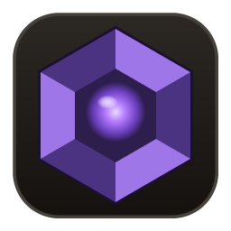
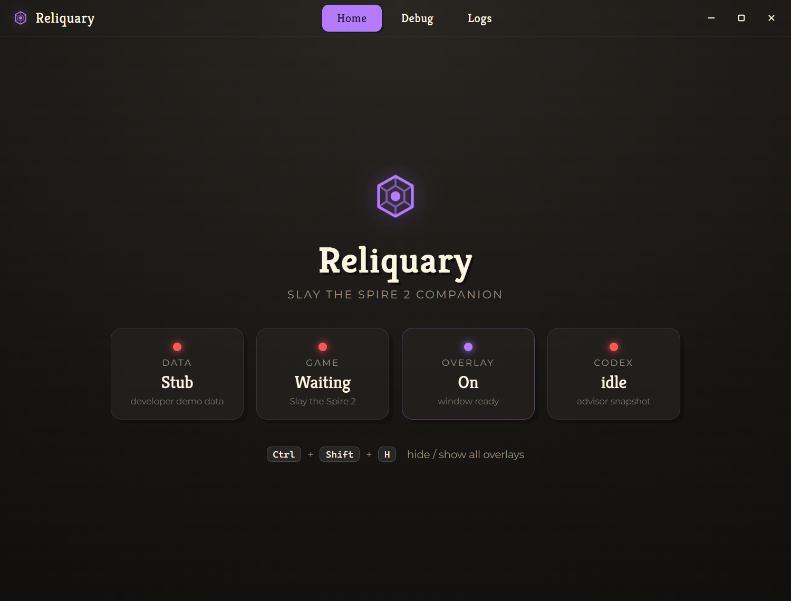
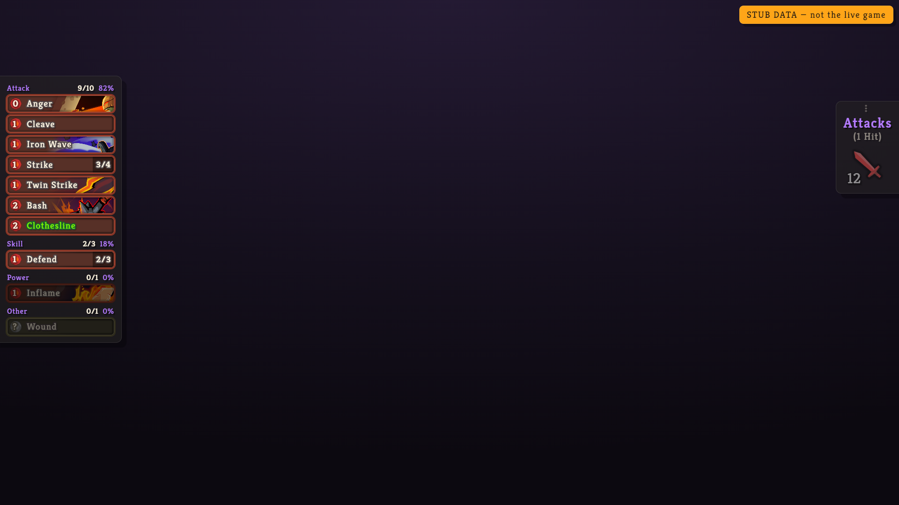
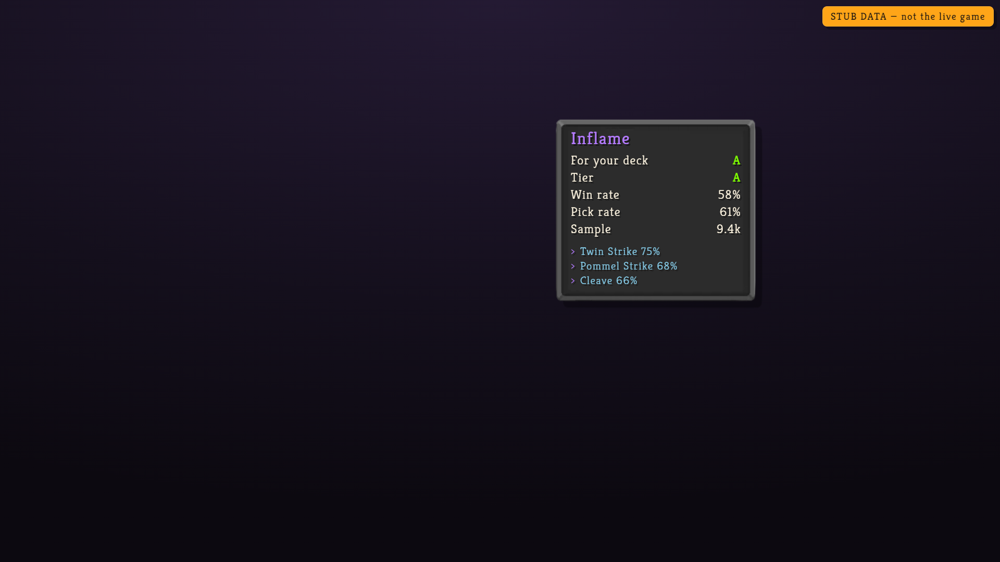

<p align="center">
  
</p>

<h1 align="center">Reliquary</h1>

<p align="center">
  A transparent, click-through <b>Slay the Spire 2</b> companion overlay —<br/>
  deck tracker, deck-conditioned draft advice, and incoming-attack forecasts.
</p>

<p align="center">
  
  
  
  
</p>

---

**Reliquary** reads live game state directly from Slay the Spire 2's process memory and paints
a HUD over the game — no log files, no manual input. It's modeled on the Untapped.gg Companion,
rebuilt from scratch on Electron + React.



## Features

- **Deck tracker** — draw-pile odds grouped by type (Attack / Skill / Power / Other), with
  per-group draw-% and card counts. Collapsible, and draggable to reposition.
- **Draft advice** — deck-conditioned *"for your deck"* letter grades on card rewards,
  choose-a-card, and shop cards, alongside global tier, win-rate, pick-rate, and the owned
  cards driving each pick. An animated placeholder shows while a grade is still loading.
- **Attack forecast** — total incoming damage and hit count from enemy intents, in combat.
- **Branded dashboard** — a frameless companion window with **Home / Debug / Logs** tabs:
  live status, overlay toggles, a syntax-highlighted game-state inspector, and a streaming
  in-app log viewer.

<table>
  <tr>
    <td width="50%"></td>
    <td width="50%"></td>
  </tr>
  <tr>
    <td align="center"><sub>Deck tracker + attack forecast, in combat</sub></td>
    <td align="center"><sub>Deck-conditioned draft advice on a card reward</sub></td>
  </tr>
</table>

> The overlay shots use the built-in demo data (`SPECTRA_STUB`), hence the "stub data" badge.

## How it works

- **Game state** comes from process memory via a vendored native module (`untapped-scry`),
  read on a ~150 ms poll loop and diffed so the UI only updates on real change.
- **Card metadata** (names, types, costs, art) is fetched from the Untapped CDN.
- **Advice & stats** come from the Spire Codex API (`/api/cards`,
  `/api/runs/metrics/cards`, `POST /api/draft-advice`), primed once per data version and cached.
- Two windows share one React bundle via hash routing: a transparent, click-through,
  always-on-top **overlay** pinned to the game window, and a normal **dashboard**.

## Requirements

- Windows 10/11
- Node.js 20+
- Slay the Spire 2

## Getting started

```bash
npm install
npm run dev          # launches the dashboard + overlay (electron-vite)
```

Try it without the game, using built-in demo data:

```powershell
$env:SPECTRA_STUB = 1; npm run dev
```

Build a Windows installer (NSIS → `release/`):

```bash
npm install --save-dev electron-builder
npm run dist
```

Regenerate the app icon (`build/icon.ico` + `resources/icon.png`):

```bash
npm run icon
```

## The native module

Reliquary reads game memory through small vendored native modules in `vendor/`
(`untapped-scry` — the memory reader — and `untapped-node-native` — Win32 window helpers).
They're bundled into the packaged app (electron-builder `extraResources`), so the installer
works out of the box with no extra setup. If the module ever fails to load, the app still
launches: the dashboard runs, `SPECTRA_STUB` demo mode works, and the overlay waits for the game.

## Hotkeys

| Shortcut | Action |
| --- | --- |
| `Ctrl + Shift + H` | Hide / show all overlays |

## Tech stack

Electron 33 · React 18 · TypeScript · styled-components · electron-vite · electron-builder.

## Disclaimer

Reliquary is an **unofficial**, personal/educational project. It is not affiliated with or
endorsed by MegaCrit (Slay the Spire) or Untapped.gg. Reading game memory and using third-party
APIs may conflict with a game's or a service's terms of use — use at your own risk.

## Acknowledgements

Reliquary is only possible thanks to the data behind it:

- 💜 **[Spire Codex](https://spire-codex.com)** — for the card stats and deck-conditioned
  draft-advice API that powers every recommendation Reliquary makes. Thank you!
- **[Untapped.gg](https://untapped.gg)** — for the Slay the Spire 2 card-metadata CDN, and for
  the Companion overlay that inspired this project.
- **[MegaCrit](https://www.megacrit.com)** — for making Slay the Spire 2.

## License

[MIT](LICENSE) © Brandon Barker — for the application code in this repository. The vendored
native module and any third-party assets or APIs are not covered and remain the property of
their respective owners.
